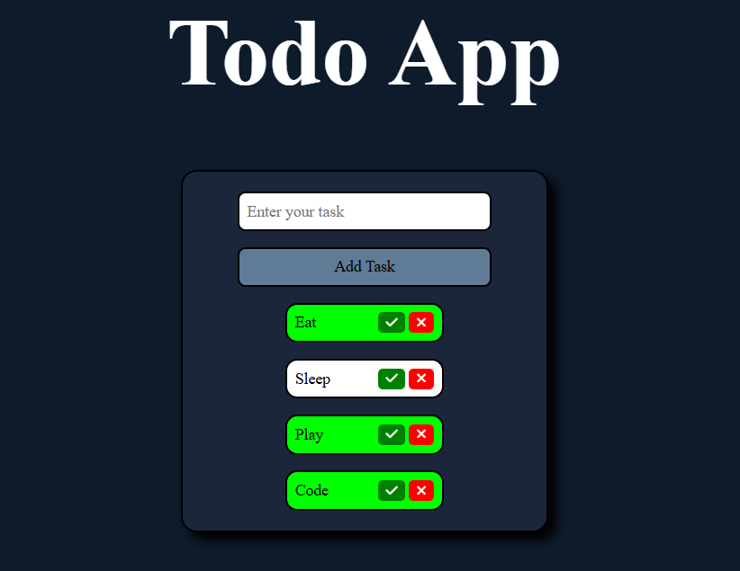

# TO-DO APP

````markdown
# ✅ To-Do App

A clean and functional web-based To-Do List application built using HTML, CSS, and JavaScript. This project helps you manage daily tasks with a smooth and intuitive user interface.

## 📸 Screenshots



## 🚀 Features

- Add new tasks quickly
- Mark tasks as completed
- Delete tasks with ease
- Local storage support for data persistence
- Responsive design for all devices
- Simple and modern UI

## 🛠️ Tech Stack

- **Frontend:** HTML5, CSS3, JavaScript (Vanilla)

## 📂 Folder Structure

```bash
todo-app/
├── index.html
├── style.css
├── script.js
├── README.md
└── screenshot.png
```
````

## 💡 How to Use

1. Clone this repository:

   ```bash
   git clone https://github.com/Ghousiadreams/Todo-App.git
   ```

2. Navigate into the project folder:

   ```bash
   cd todo-app
   ```

3. Open `index.html` in your browser:

   ```bash
   start index.html
   ```

## 📈 Future Improvements

- Add dark/light mode toggle
- Enable task editing
- Sync tasks with a backend or database
- Add user accounts and authentication

## 🙌 Acknowledgements

- Inspired by minimalist productivity apps
- Icons from [Font Awesome](https://fontawesome.com/)

## 📬 Contact

Reach out:

- 📧 Email: \[[mghousia543@gmail.com]]
- 🐙 GitHub: [@Ghousiadreams](https://github.com/Ghousiadreams)

---

Made with ❤️ by **Ghousia**

```

---

Let me know if you'd like to:
- Add real screenshots
- Replace the GitHub/email placeholders
- Include any extra features you've built (e.g., animations, filters, etc.)

```
